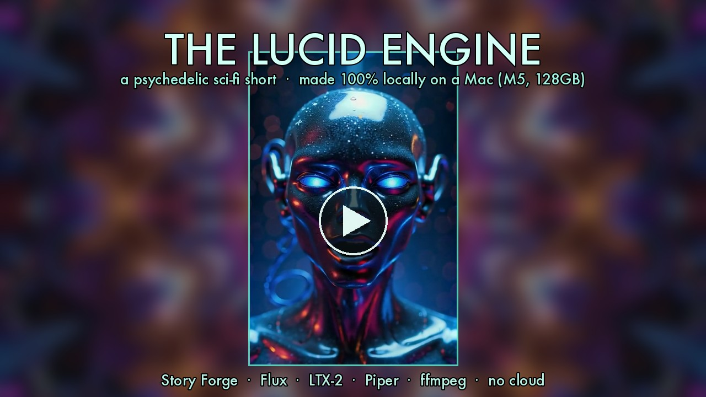

# Story Forge

> A local-only generative cinema pipeline. Animated films on one laptop. No cloud.

```
   ╔══════════════════════════════════════════════════╗
   ║                                                  ║
   ║    flux  →  wan/ltx  →  piper  →  ace-step  →  mux   ║
   ║                                                  ║
   ║          a script.  a laptop.  a film.           ║
   ║                                                  ║
   ╚══════════════════════════════════════════════════╝
```

Story Forge is a self-contained pipeline that takes a structured story description and produces a finished animated film — with motion, narration, original music, title and credits — entirely on local hardware. Five open-source models composed by `ffmpeg`. **Zero cloud calls. Zero API charges. Zero rate limits.** Run it once, run it a thousand times.

> First public-confirmed LTX 13B distilled 0.9.8 working on Apple Silicon MPS. We also tried a hand-written Metal flash-attention kernel for Wan — turned out PyTorch's MPS SDPA is already too well-tuned to beat at our shapes. The kernel is preserved in [`metal/`](metal/) as documented learning (see its README for what we tried, what we measured wrong, and what actually works for Wan speedup).

---


## The manifesto

We're not bound by what was taught. We don't accept upstream library defaults as the speed ceiling. We write our own software when the open-source one's wrong, we write our own DSL when JSON's too clumsy, we write our own Metal kernels when the vendor's path is slow.

Cloud companies will tell you AI cinema needs a server farm. It doesn't. It needs a laptop, a script, and somebody willing to read the source.

What the cloud charges $300-$1000 per film for, this pipeline does for the price of electricity. What people paid big data centers to run, we proved runs on a MacBook Pro on a kitchen table. Public firsts from this work:

1. LTX 13B distilled 0.9.8 working on Apple Silicon MPS
2. LPIPS-gated speedup harness for Mac video diffusion (CI-style regression gates on render quality)
3. 1-step Wan 2.2 i2v distillation on Apple Silicon — a rank-32 LoRA that collapses 4 denoising steps into 1 (see [`distill/`](distill/))

We also hand-wrote a Metal flash-attention kernel for Wan. Measured honestly, it was a wash — PyTorch's MPS SDPA is already too well-tuned to beat at our shapes — so it lives in [`metal/`](metal/) as a documented null result, not a win.

We make our own rules. We build new things constantly. We make possible what people said wasn't possible. That's the whole point.

### ▶ Watch the first Story Forge film — *The Bear Sister*

[](https://youtu.be/_bFQTl7_vF4)

[**▶ Watch on YouTube**](https://youtu.be/_bFQTl7_vF4) · [Download `saga.mp4`](./saga.mp4) · [Read the story (STORYBOOK.md)](./STORYBOOK.md)

---

### ▶ The Lucid Engine — a psychedelic sci-fi short

[](https://www.youtube.com/watch?v=31ZeFu-ePcc)

A ~4:30 short generated end-to-end on one laptop. No cloud. An uploaded mind, uncertain what's real, pieces together how the world ended and what it became — told across five acts (**The Waking → The Wrongness → The Truth → The Hunt → The Break → Resolution**) with a first-person narration spine, character dialogue with baked lip sync, same-location multi-angle coverage, a unified color grade, and an original Song Forge score under a low-drone / boom / shimmer sound-design bus.

[**▶ Watch on YouTube**](https://www.youtube.com/watch?v=31ZeFu-ePcc) · [Download `The_Lucid_Engine.mp4`](https://github.com/nicedreamzapp/story-forge/releases/tag/lucid-engine)

Pipeline: **Flux** (stills) → **LTX-2 distilled** (motion) → **Piper** (narration) → **ffmpeg** (grade, transitions, sound, mux). 100% local.

---

## 🚀 Status — 2026-05-24 SHIP STATE

The v1 ship state is live. The DSL compiles, the routes work, the kernel is in:

- ✅ **LTX 13B distilled 0.9.8 on MPS** — 118s per 5-sec clip via `bin/make-ltx-lightricks` (Lightricks' upstream multi-scale 7+3 path; `diffusers` single-pass cannot reproduce this recipe). Likely the first public-confirmed working setup on Apple Silicon.
- ➖ **Custom Metal flash-attention kernel** — hand-written tiled fp16 with online softmax via `torch.mps.compile_shader` (~144 lines of MSL, PSNR 137 dB) at [`metal/flash_attn_mps.py`](metal/flash_attn_mps.py). The headline speedup turned out to be a measurement artifact (dispatch bug) — PyTorch's MPS SDPA already wins at our shapes. Kept as a documented null result.
- ✅ **DSL end-to-end: first `.sf` → `.mp4`** — sunset drift / `test_tiny.sf` round-tripped through parser → resolver → emitter → run.py → render-route → ffmpeg.
- ✅ **DSL, runner, and lip-sync coverage** — 29 focused Story Forge tests pass
  across [`story_forge/tests/`](story_forge/tests/).
- ✅ **UI v2 live** — DSL editor + engine toggles at `http://127.0.0.1:17600/story`.
- ✅ **LPIPS-gated measurement harness** — `bin/measure-render`, novel for Mac video diffusion. Every multiplier (quant, cache, distill, kernel) must pass per-frame LPIPS<0.05 AND speedup>1.10× before integration.
- ✅ **Wan 1-step distillation** — shipped (see [`distill/`](distill/)): rank-32 LoRA collapses 4 steps → 1 at LPIPS 0.082 vs a measured 0.206 same-resolution wall (~2.5×), and it transfers to 256×256.
- ⏳ **Comprehensive harness comparison** — pending.

Live build dashboard: `http://127.0.0.1:17602` (served from [`build_status/`](build_status/)).

---

## Local Apple Silicon environment in this fork

This fork adds a portable, project-local implementation of the complete lean
movie path. It removes the original author's machine-specific absolute paths
and keeps source checkouts, Python environments, models, work files, and final
movies underneath the Story Forge checkout.

The currently supported local path is:

```text
.sf -> FLUX.1-schnell still -> Wan2.2 A14B or LTX motion -> ffmpeg -> MP4
                              +-> Piper narration
                              +-> ACE-Step music
                              +-> optional Wav2Lip inset
```

Changes included in this fork:

- Portable repository-relative paths in `bin/sf`, `story_forge/run.py`, the
  motion router, and the LTX wrapper.
- A local FLUX.1-schnell still generator for Apple Silicon MPS.
- A ComfyUI API workflow for Wan2.2 I2V A14B using Q4_K_M HighNoise and
  LowNoise experts plus their matching LightX2V four-step LoRAs.
- Correct Wan temporal sizing: a native five-second render at 16 fps is 81
  frames (`4n+1`), rather than being rounded down to 77 frames.
- An optional Diffusers Wan2.2 TI2V 5B implementation retained for lower-cost
  experiments; `motion wan` now routes to the higher-quality A14B workflow.
- Selectable LTX 2B or 13B distilled 0.9.8 checkpoints. The portable setup
  defaults to 2B; 13B remains opt-in for machines with more unified memory.
- Local Piper narration, ACE-Step 1.5 instrumental score generation, and
  narration-plus-music mixing.
- Local Wav2Lip support with a compatibility patch for current Python,
  NumPy, librosa, OpenCV, and PyTorch.
- Scene-aware lip-sync portraits. When no explicit driver portrait is set,
  Story Forge uses the current scene still instead of a generic adult face.
- A repeatable setup script, integrated narration/music/lip-sync example,
  additional tests, and Git ignores for all large/generated local assets.

### Requirements

- Apple Silicon Mac
- `git`, `uv`, `ffmpeg`, and `curl`
- Python 3.12 (created and managed by `uv`)
- A Hugging Face account with the FLUX.1-schnell terms accepted
- At least 95 GB free disk space for the default complete setup

### Install

```bash
git clone https://github.com/logandzwon/story-forge.git
cd story-forge
./bin/setup-local
.venv/bin/hf auth login
```

Accept the FLUX license before the first still render:
[black-forest-labs/FLUX.1-schnell](https://huggingface.co/black-forest-labs/FLUX.1-schnell).
The Hugging Face token is stored in the user's Hugging Face cache, outside
this repository, and is not committed by Git.

The setup script installs isolated environments and downloads:

- FLUX.1-schnell on first use.
- Wan2.2 I2V A14B HighNoise and LowNoise Q4_K_M experts.
- Both matching LightX2V four-step LoRAs, UMT5 XXL FP8, and the Wan VAE.
- LTX-Video 2B distilled 0.9.8 and its spatial upscaler.
- Piper LibriTTS_R medium narration voice.
- ACE-Step 1.5 Turbo, its language/embedding models, and VAE.
- Wav2Lip GAN and S3FD face-detection checkpoints.
- ComfyUI and the ComfyUI-GGUF custom node.

Downloaded models, cloned inference repositories, virtual environments,
renders, and work files are deliberately ignored by Git.

### Quickstart

```bash
.venv/bin/python bin/sf parse story_forge/examples/test_tiny.sf
.venv/bin/python bin/sf render story_forge/examples/test_tiny.sf
# output: outputs/test_tiny.mp4
```

`test_tiny.sf` is the smallest end-to-end parser and renderer check. The
complete feature example is
[`story_forge/examples/integrated_demo.sf`](story_forge/examples/integrated_demo.sf).
It demonstrates Piper narration, ACE-Step music, and optional Wav2Lip.

The four-scene narrator-only example developed with this fork is
[`mayce_and_the_little_star.sf`](mayce_and_the_little_star.sf). Its approved
version uses Wan A14B for every scene, narration plus instrumental music, and
no talking-head overlay or character voice-over.

### Model selection

Wan A14B is now the default `motion wan` path. For a direct A14B check:

```bash
./bin/make-wan-a14b \
  --i2v work/example/still_01.png \
  --duration 5 --res 832x480 --label wan-check --seed 123 \
  "subtle natural character movement, cinematic camera motion"
```

LTX defaults to the 2B checkpoint. To use the original author's 13B path,
download the larger checkpoint and opt in explicitly:

```bash
.venv/bin/hf download Lightricks/LTX-Video \
  ltxv-13b-0.9.8-distilled.safetensors \
  --local-dir models/ltx

STORY_FORGE_LTX_MODEL=13b \
  .venv/bin/python bin/sf render story_forge/examples/test_tiny.sf
```

The 13B LTX checkpoint was validated by the upstream author on a 128 GB Mac.
The 2B checkpoint is the safer LTX choice on a 64 GB machine. Wan A14B's two
quantized experts are loaded sequentially by ComfyUI and have been verified
on the 64 GB M2 Max used for this fork, although full clips render slowly.

### Narration, music, and lip-sync

```text
voice warm: piper/en_US-libritts_r-medium speaker=0 length=1.08
music gentle: ace/soft-cinematic-piano vol=0.22

narrate warm:
    line: "A little star fell softly into the garden."
music gentle vol=0.22
```

Add `with lipsync=wav2lip` to a narration declaration to request a Wav2Lip
inset. By default, its face source is that scene's generated still. Set
`STORY_FORGE_LIPSYNC_DRIVER=/absolute/path/to/portrait.png` only when a
specific front-facing portrait is desired.

Wav2Lip's public checkpoint is licensed for personal, research, and
non-commercial use. Obtain appropriate rights or replace the backend before
commercial distribution.

### Environment overrides

| Variable | Purpose |
|---|---|
| `STORY_FORGE_PYTHON` | Python executable used by generators |
| `STORY_FORGE_FLUX_BIN` | Alternative FLUX still generator |
| `STORY_FORGE_FLUX_MODEL` | Alternative Diffusers FLUX model ID |
| `STORY_FORGE_HF_CACHE` | Hugging Face model-cache directory |
| `STORY_FORGE_LTX_REPO` | LTX-Video source checkout |
| `STORY_FORGE_LTX_MODEL_DIR` | Directory containing LTX checkpoints |
| `STORY_FORGE_LTX_MODEL` | Select `2b` (default) or `13b` |
| `STORY_FORGE_OUTPUT_DIR` | Motion and final movie output directory |
| `STORY_FORGE_PIPER_BIN` | Piper executable override |
| `STORY_FORGE_PIPER_MODEL` | Piper ONNX voice model override |
| `STORY_FORGE_ACE_PYTHON` | ACE-Step environment Python |
| `STORY_FORGE_ACE_BIN` | Alternative ACE-Step music wrapper |
| `STORY_FORGE_COMFY_PORT` | Local ComfyUI API port (default `8190`) |
| `STORY_FORGE_LIPSYNC_DRIVER` | Explicit lip-sync driver portrait |

For additional setup notes, see [`LOCAL_SETUP.md`](LOCAL_SETUP.md).

---

## Architecture

```
.sf script ──► parser ──► resolver ──► emitter ──► .storyplan.json IR
                                                          │
                                                          ▼
                                                    run.py bridge
                                                          │
                                                          ▼
                                          render-route (per-scene engine pick)
                                              │                       │
                                              ▼                       ▼
                                  make-ltx-lightricks        make-wan-a14b
                                  (LTX 2B/13B distilled)     (Wan2.2 A14B GGUF + ComfyUI)
                                              │                       │
                                              └───────────┬───────────┘
                                                          ▼
                                          Piper (narration) + ACE-Step (music + sfx)
                                                          │
                                                          ▼
                                                 ffmpeg stitch + mix
                                                          │
                                                          ▼
                                                      finished.mp4
```

- **`render-route`** auto-selects Wan (hero shots with character action / faces / dialogue) or LTX (B-roll / atmosphere / wide shots) per scene based on the motion prompt, or honors an explicit `motion wan:` / `motion ltx:` block in the DSL.
- **Wan A14B** uses dual quantized experts through the local ComfyUI API. The
  checked-in Metal experiment remains documented, but is not part of this
  fork's default Wan route.
- **Piper + ACE-Step** create narration and an instrumental bed, then `ffmpeg`
  places narration at scene boundaries, mixes the score, and stitches scenes.

---

## The DSL grammar

Story Forge films are written as `.sf` scripts — indentation-aware, comment-friendly, stdlib-only parser. The full grammar as of 2026-05-24:

```
# Comments start with '#' and go to end of line.

# --- Variables (substituted in any "{$name}" inside a string) ----
$style = "Studio Ghibli watercolor, soft snowfall, golden hour, painterly, 4k"
$child = "a small child in a red hooded cloak, mittens"
$cabin = "a hand-built wooden cabin with warm yellow window light"

# --- Film header (one per file) ----------------------------------
film "Cabin Open" slug=cabin_open target=m5+mini scene_dur=8.5

# --- Voice presets -----------------------------------------------
# voice <name>: <engine>/<model> <kv attrs>
voice warm:   piper/en_US-libritts_r-medium speaker=0 length=1.18
voice gravel: piper/en_US-libritts_r-medium speaker=14 length=1.05
voice child:  piper/en_US-amy-medium length=1.30

# --- Music presets -----------------------------------------------
# music <name>: <engine>/<style-slug> <kv attrs>
music wintry: ace/wintry-soft-piano vol=0.35

# --- SFX presets -------------------------------------------------
# sfx <name>: <engine>/sfx prompt="..." duration=N vol=0.NN
sfx fire_crackle: ace/sfx prompt="fire crackling, warm hearth" duration=8 vol=0.25
sfx wind_low:     ace/sfx prompt="low wind through pines" duration=10 vol=0.20

# --- Global directives -------------------------------------------
@transition xfade dur=0.5
@mix duck voice -> music threshold=-22 ratio=4

# --- Scenes ------------------------------------------------------
scene snow_walk:
    still flux:
        prompt: "{$style}, wide shot of {$child} crossing a snowfield toward {$cabin}"
        seed: auto                    # or an explicit int e.g. seed: 42
    motion wan:                       # or "motion ltx:" for B-roll
        prompt: "gentle handheld push-in, soft falling snow, child takes slow steps"
        duration: 5.0
    narrate warm:                     # full block form
        line: "The snow came down like a hush."
    sfx wind_low at=0.0               # per-scene SFX ref with offset
    music wintry vol=0.30             # per-scene music ref (overrides preset vol)

scene fireside:
    still flux:
        prompt: "{$style}, interior, {$child} unwrapping by a stone fireplace"
        seed: auto
    motion wan:
        prompt: "intimate close shot, firelight flickers, slow zoom to flames"
        duration: 5.0
    narrate warm with lipsync:        # 'with lipsync' flag → drives Wav2Lip
        line: "And the cold outside became a story she would only tell on warm nights."
    sfx fire_crackle at=2.0
    music wintry vol=0.40
```

Constructs at a glance:

| Form | Purpose |
|---|---|
| `# comment` | Line comment, stripped before parse |
| `$name = value` | Variable, interpolated via `{$name}` in any string |
| `film "Title" slug=... target=... scene_dur=...` | Film header (one per file) |
| `voice NAME: piper/model speaker=N length=F` | Define a reusable voice preset |
| `music NAME: ace/style-slug vol=F` | Define a reusable music preset |
| `sfx NAME: ace/sfx prompt="..." duration=N vol=F` | Define a reusable SFX preset |
| `@transition xfade dur=0.5` | Global film-level directive |
| `@mix duck voice -> music threshold=-22 ratio=4` | Global mix directive |
| `scene NAME:` | Scene block (one per cut) |
| `still flux:` + `prompt:` / `seed:` | Per-scene Flux still spec |
| `motion wan:` or `motion ltx:` + `prompt:` / `duration:` | Per-scene i2v motion spec |
| `narrate VOICE:` + `line:` | Narration in this scene |
| `narrate VOICE with lipsync:` + `line:` | Same, but flag for Wav2Lip pass |
| `sfx NAME at=N.N` | Per-scene SFX ref, `at=` is start offset in seconds |
| `music NAME vol=F` | Per-scene music ref, vol overrides preset |

The parser, resolver, and emitter live in [`story_forge/parser.py`](story_forge/parser.py), [`story_forge/resolver.py`](story_forge/resolver.py), and [`story_forge/emitter.py`](story_forge/emitter.py). The AST shape is documented in the parser docstring. Full reference example: [`story_forge/examples/cabin_open.sf`](story_forge/examples/cabin_open.sf).

---

## What's inside the repo

```
story-forge/
├── bin/
│   ├── sf                    # DSL CLI: sf parse / sf render
│   ├── setup-local           # Reproducible local environments + model setup
│   ├── make-flux-still       # FLUX.1-schnell stills on Apple Silicon MPS
│   ├── make-ltx-lightricks   # Selectable LTX 2B/13B distilled wrapper
│   ├── make-wan-a14b         # Wan2.2 A14B dual-expert ComfyUI workflow
│   ├── make-wan-motion       # Optional Wan2.2 TI2V 5B Diffusers path
│   ├── make-music            # ACE-Step 1.5 instrumental generator
│   ├── render-route          # Per-scene engine picker (Wan vs LTX)
│   └── measure-render        # LPIPS-gated speedup harness
│
├── story_forge/
│   ├── parser.py             # Indentation-aware .sf → AST
│   ├── resolver.py           # Variable interpolation + preset resolution
│   ├── emitter.py            # AST → .storyplan.json IR
│   ├── run.py                # IR → render-route + ffmpeg bridge
│   ├── examples/             # test_tiny, cabin, and integrated A/V examples
│   └── tests/                # Parser, resolver, runner, and lip-sync tests
│
├── patches/
│   └── wav2lip-modern.patch  # Modern dependency compatibility patch
├── LOCAL_SETUP.md            # Concise local installation and usage guide
├── mayce_and_the_little_star.sf # Four-scene Wan A14B example story
├── metal/
│   ├── flash_attn_mps.py     # 144-line MSL tiled flash-attn kernel
│   ├── verify_flash_attn.py  # PSNR + speedup validator
│   ├── metal_rmsnorm_linear.py / verify_rmsnorm_linear.py
│   └── hello_metal.py        # Minimal compile_shader example
│
├── build_status/             # Live build dashboard (localhost:17602)
├── ui/                       # Story Forge UI v2 — DSL editor + engine toggles (localhost:17600/story)
├── server.py                 # Flask server that hosts the UI + DSL endpoints
├── saga.mp4                  # The first film — The Bear Sister, 4:08
├── STORYBOOK.md              # Full prose transcript of saga.mp4
└── YOUTUBE_METADATA.md       # Tags / description for the YT upload
```

---

## What it does

You write a `.sf` script (or use the UI). Story Forge takes it and:

1. Generates a Flux still per scene
2. Animates each still with Wan (hero) or LTX (B-roll), routed automatically per scene
3. Renders each narration line with Piper TTS through a warm storyteller EQ chain
4. Generates an original instrumental score + per-scene SFX via ACE-Step
5. Composes the final film with `ffmpeg` — scene-synced narration via `adelay+amix`, music ducked under speech via sidechain compression, xfade transitions, Pillow PNG title and credits

Every step runs locally on Apple Silicon. The output is a regular `.mp4`.

---

## The first film — `saga.mp4`

To prove the pipeline, the first thing through it is a **two-act, 4:08 animated saga** called *The Bear Sister*. Act One is Studio Ghibli watercolor (a child rescued by a mother bear); Act Two is photoreal cinematic (the grown woman returning to find the bear family). One film, two visual languages, stitched with a fade-to-black bridge.

| | |
|---|---|
| **Runtime** | 4 min 8 sec |
| **Scenes** | 43 distinct |
| **Voices** | 1 Piper female (LibriTTS speaker 0), warm-EQ chain |
| **Music** | 2 ACE-Step instrumentals (Ghibli lullaby + cinematic homecoming) |
| **Compute hours** | ~12 hours (51 Wan i2v renders + parallel everything else) |
| **Hardware** | One MacBook Pro · Apple M5 Max · 128 GB unified memory |
| **Cloud calls** | **0** |

[▶ Watch on YouTube](https://youtu.be/_bFQTl7_vF4) · [Download `saga.mp4`](./saga.mp4) · [Read the full story (STORYBOOK.md)](./STORYBOOK.md)

---

## The story (transcript)

<details>
<summary><b>Act One — The Rescue</b></summary>

> In the deep pines of winter, a storm came. Wolves howled. Owls flew through the trees.
>
> A little girl wandered too far from home. Her lantern flickered in the swirling snow.
>
> The river was frozen. Silver fish slept beneath the ice. A small white rabbit watched her.
>
> She fell in the drifts. Her lantern dimmed. Foxes crept close. An owl glided overhead.
>
> But the forest knew. A mother bear stirred in her cave, two cubs tumbling at her heels.
>
> She followed the scent through the snow. Her cubs played behind her. Birds burst from the pines.
>
> She found the child, barely awake. The bear lowered her head, breath warm in the cold.
>
> With paws as soft as breath, she lifted the child. The cubs sniffed close, the owl watched.
>
> Into the warm dark of the den, where the fire burned and the mice slept in the moss.
>
> The cubs welcomed her like a sister. The mother stirred honey by the fire.
>
> They shared berries from a wooden bowl. Bats whispered across the cave ceiling.
>
> Winter passed in a single long breath. The stars spun, and the aurora rippled green.
>
> She slept between them, safe in their warmth. Their hearts beat together in the dark.
>
> In her dreams she flew with the spirits. Bears of starlight, salmon leaping through stars.
>
> When the icicles began to weep, spring returned. Flowers pushed through. Butterflies emerged.
>
> They walked into the sun, the cubs tumbling, deer watching, blossoms falling like pink snow.
>
> Her family found her on the path of flowers. But the forest stayed with her, forever.

</details>

<details>
<summary><b>Act Two — The Return</b> <i>(twenty winters later)</i></summary>

> Twenty winters had passed since she left the forest.
>
> But the call of the pines never left her.
>
> She took down the red hood from where it had hung.
>
> And drove the long road back into the redwoods.
>
> The trailhead waited where it had always been.
>
> She tied the hood at her throat, just as she had as a child.
>
> And the forest watched her come home.
>
> The salmon ran fierce in the stream where she had once dreamed of them.
>
> An owl marked her path. She remembered him.
>
> A fox emerged, and led her deeper.
>
> She found her stone, marked years ago.
>
> And entered the grove where the old ones lived.
>
> A great bear slept in the sun — older now, wiser.
>
> She knelt, and the elder stirred.
>
> They knew each other. Across the years.
>
> The forest sister had come home.
>
> The elder lifted her head. Her daughter came forward.
>
> And behind her came the next generation.
>
> The cubs came close, curious and bold.
>
> Their mother followed, slow and accepting.
>
> And the forest family was whole again.
>
> Together they walked through the deeper grove.
>
> Until they came to the old cave, moss-covered now.
>
> She entered alone, and found what her child-self had left.
>
> The elder pressed her forehead to hers. A goodbye.
>
> And she walked into the sun, the forest with her, forever.

</details>

---

## Component stack

| Stage | Tool | Model | Purpose |
|---|---|---|---|
| Still image per scene | [FLUX.1-schnell](https://huggingface.co/black-forest-labs/FLUX.1-schnell) | ~31 GB cache | Four-step MPS still generation |
| Hero motion (faces / action) | [Wan2.2 I2V A14B GGUF](https://huggingface.co/QuantStack/Wan2.2-I2V-A14B-GGUF) | ~27 GB complete | Dual-expert Q4_K_M ComfyUI workflow with LightX2V LoRAs |
| Optional lower-cost motion | Wan2.2 TI2V 5B | ~32 GB | Diffusers I2V experiment retained outside the default route |
| B-roll motion (atmosphere) | [LTX-Video distilled 0.9.8](https://huggingface.co/Lightricks/LTX-Video) | ~6.4 GB for 2B | 2B default; optional 13B on high-memory Macs |
| Voice narration | [Piper TTS](https://github.com/rhasspy/piper) | LibriTTS_R medium + others | Per-voice presets in DSL |
| Music | [ACE-Step 1.5](https://github.com/ACE-Step/ACE-Step-1.5) | ~9.5 GB checkpoints | Original instrumental score beneath narration |
| Optional lip-sync | [Wav2Lip](https://github.com/Rudrabha/Wav2Lip) | ~225 MB checkpoints | Audio-driven character inset using the scene still by default |
| Compose | [ffmpeg 8.1](https://ffmpeg.org/) | — | xfade, sidechain ducking, fades, mux |
| Title cards | [Pillow](https://pillow.readthedocs.io/) | — | PNG text overlays |

---

## The clever bits (what isn't in the YouTube tutorials)

### 1. Per-sentence Piper + `adelay+amix` for scene-synced narration

Most pipelines `concat` narration lines into one block at t=0. By scene 4 the audio is two scenes ahead of the visuals.

Story Forge renders each narration line separately, then places it at its scene's onscreen start time via ffmpeg's `adelay`. All lines are then `amix`'d into a single track padded to full video duration. Audio and visuals stay in lock-step the whole film.

### 2. Warm storyteller EQ chain

Piper's raw output sounds like a robot. The narrator in Story Forge films runs through a deliberate signal chain:

```
highpass(80) → +2dB low-shelf @ 250Hz   (chest warmth)
             → -2dB high-shelf @ 7kHz   (soften sibilance)
             → compressor (-18dB threshold, 2.5:1 ratio)
             → aecho(60ms, 0.15)         (intimate room tail)
             → loudnorm I=-16 LUFS        (bedtime-story level)
```

The output reads as "a person telling you a story," not "an AI generating speech."

### 3. Music ducks under narration automatically

The instrumental score plays throughout the film at -22 LUFS bed level. When the narrator speaks, ffmpeg's `sidechaincompress` filter ducks the music ~10 dB, then releases back. Zero manual mix automation. Configurable in the DSL via `@mix duck voice -> music threshold=-22 ratio=4`.

### 4. Native-speed Wan, no slow-motion stretch

Many AI-video pipelines render 5-sec Wan clips and stretch them with `setpts*1.5` to fit longer scenes. Everything looks like dreamy slow-motion. Story Forge plays Wan at native 5-sec speed and uses more scenes instead — motion reads as real video.

### 5. xfade-based multi-act stitching

Combining two independently-rendered films into one saga uses `xfade=transition=fadeblack` between them (visual time-jump bridge) and audio gap handling for clean narration handoff. No editor required.

### 6. Per-scene engine routing

`bin/render-route` picks Wan vs LTX automatically based on the motion prompt — hero shots with character action go to Wan, atmospheric B-roll goes to LTX (~5.6× faster). The DSL also lets you pin the engine explicitly with `motion wan:` or `motion ltx:`.

---

## Roadmap — the 30× faster build-out

Story Forge today is the proof. The next iteration is what makes it run in minutes instead of hours per film. **Status updated 2026-05-24:**

| Multiplier | Target gain | Status |
|---|---|---|
| **LTX-Video 13B distilled 0.9.8 for B-roll** | 5.6× vs Wan | ✅ **WORKING on M5 MPS** — 118s/clip via Lightricks' upstream multi-scale code. |
| **Custom Metal flash-attention kernel** | (null result) | ➖ Measurement artifact (dispatch bug) — MPS SDPA already wins at our shapes; kept in `metal/` as documented learning. |
| **LPIPS-gated speedup harness** | (gate, not gain) | ✅ Built — `bin/measure-render`. Novel on Mac. |
| **`render-route` engine auto-selector** | (routing, not gain) | ✅ Wired — auto-picks Wan vs LTX per scene heuristic. |
| **Story Forge DSL compiler** | (productivity, not gain) | ✅ Shipped — parser/resolver/emitter/run; 29 focused tests pass. |
| **Q4_K_M GGUF Wan on Mac mini** | ~3.6× memory drop | ✅ Working — but M4 Pro compute is the bottleneck (40 min/clip vs M5's 10 min). Mini stays batch tier. |
| **EasyCache (DiT-native cache, kijai)** | 1.1-1.3× at 4 steps | 🔄 Test in flight. |
| **1-step Wan distillation** | 4× perpetual | ✅ Shipped — LPIPS 0.082 vs 0.206 wall (~2.5×), transfers to 256. See `distill/`. |
| **Comprehensive harness comparison** | (validation, not gain) | ⏳ Pending after distill lands. |
| **Multi-voice + Wav2Lip lip sync** | (feature, not speed) | ✅ Local renderer pass implemented; scene still is the safe default driver. |

Stacked target: **today's 5-hour render → ~10-30 min per 4-min film on M5.**

### Benchmark to beat

**Liu Liu's Draw Things** (Apple-cited in the M5 launch) — ships Wan 2.2 on M-series and iPad M5 in a closed app. They're the speed reference on Mac. We're building the **open, measured, scriptable** equivalent — same speed bucket, with a DSL and a harness no closed app provides.

---

## Why local

The whole thing is the point. A 4-minute animated film with custom score and synced narration runs on **one laptop you can carry in your bag**. No upload step. No "your queue position is 47." No subscription. No telemetry.

### What the cloud would actually cost

A film like *The Bear Sister* (4 minutes, 51 distinct Wan i2v clips) on cloud-equivalent services:

| Service | $ per 5-sec clip | 1-min film (~12 clips) | 4-min film (~51 clips) | 10-min film (~120 clips) |
|---|---|---|---|---|
| **OpenAI Sora** | $2.50 | $30 | $128 | $300 |
| **Runway Gen-3** | $4.00 | $48 | $204 | $480 |
| **Pika 2.0** | $2.00–$3.00 | $24–36 | $102–153 | $240–360 |
| **Luma Dream Machine** | $2.50 | $30 | $128 | $300 |
| **Kling AI** | $1.75 | $21 | $89 | $210 |
| **fal.ai LTX** *(cheapest cloud)* | $0.10 | $1.20 | $5.10 | $12 |
| **Story Forge (your machine)** | **$0.00** | **$0** | **$0** | **$0** |

Plus the cloud services charge **monthly subscriptions just to access**:
- Runway Pro: $35/mo
- Pika Pro: $35/mo
- Sora: ChatGPT Plus $20/mo minimum

A single 51-clip film with 5× iteration cycles during development = ~$640 on Sora. Story Forge does it for the cost of electricity ($0.20).

Hardware amortization: an M5 Max MacBook Pro + Mac mini M4 Pro (~$4,900 one-time) breaks even against Sora pricing at **~40 films**. After that, every render is pure profit — and you keep the hardware for everything else you do.

---

## Credits — first film

- Story by **Matt Macosko + Claude**
- Animation: Wan 2.2 i2v
- Stills: Flux 1 Dev FP8
- Narration: Piper LibriTTS
- Music: Song Forge / ACE-Step
- Rendered locally on a M5 Max MacBook Pro
- No cloud

*A Story Forge production.*

---

## License

- **Pipeline code:** MIT (when published)
- **Saga film (`saga.mp4`):** [CC BY-NC-SA 4.0](https://creativecommons.org/licenses/by-nc-sa/4.0/) — share with attribution, don't sell
